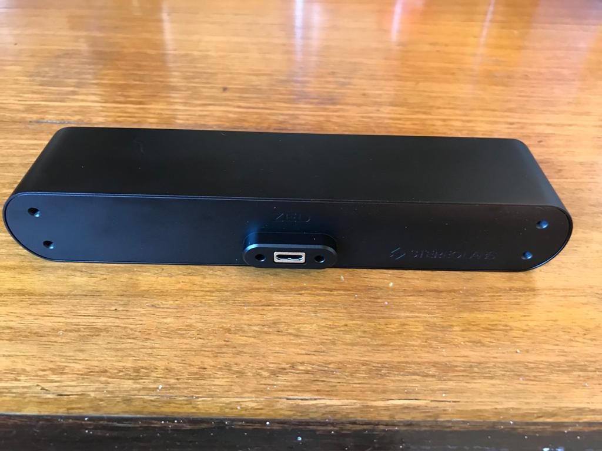
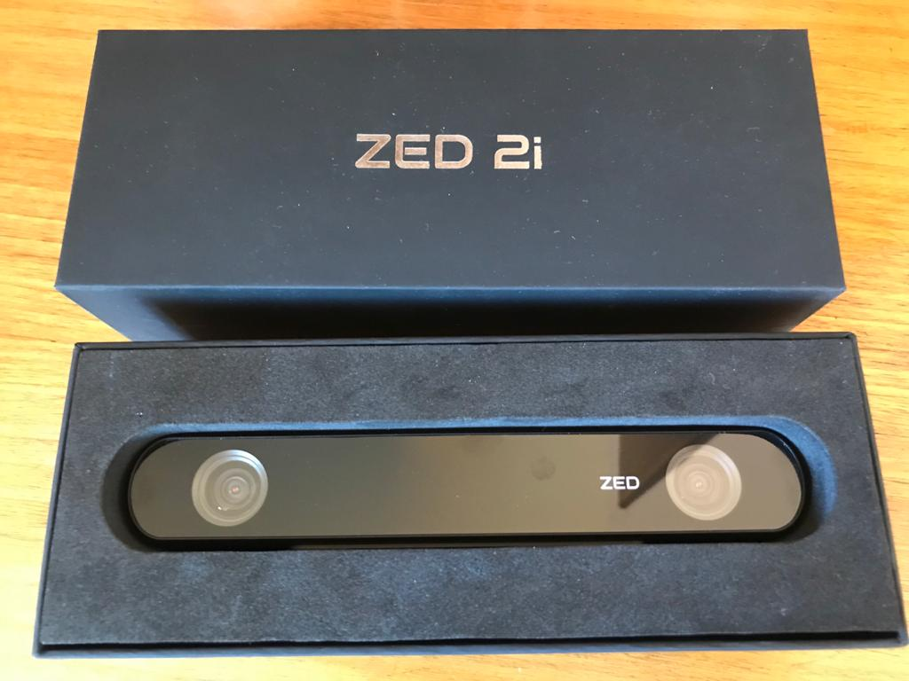
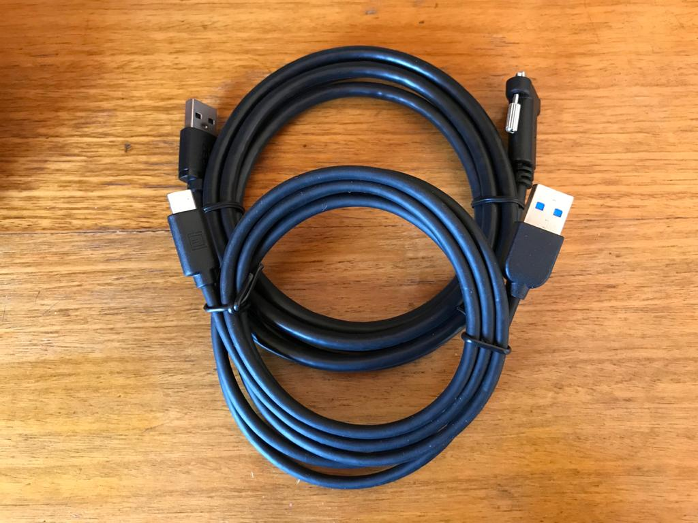
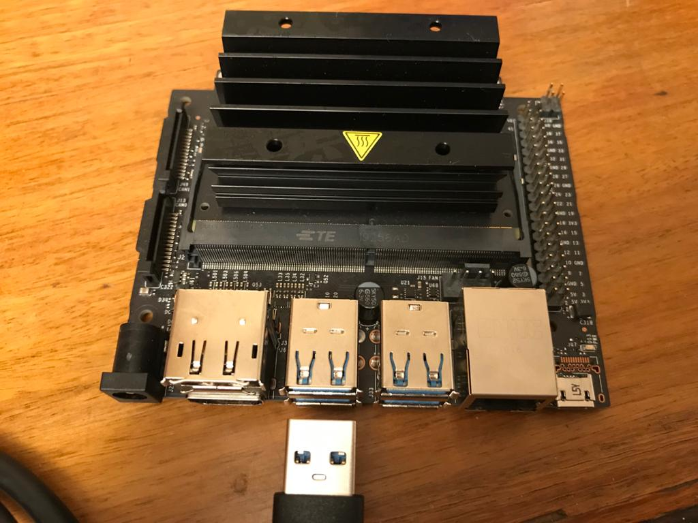
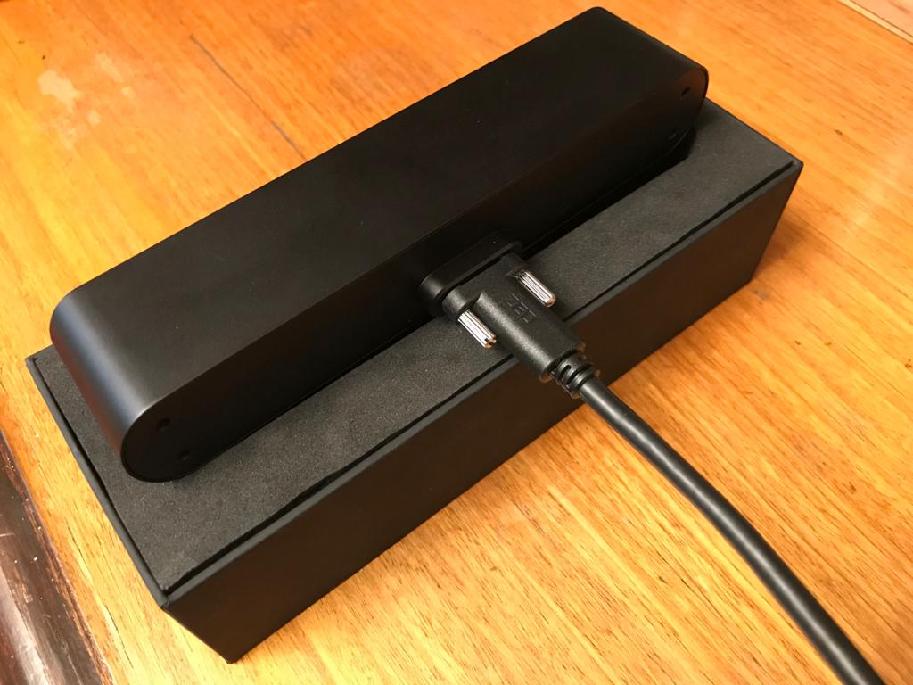

# Cámara estéreo ZED 2i

El siguiente repositorio tiene como objetivo analizar el funcionamiento del dispositivo
*ZED 2i*, el cual corresponde  una cámara estéreo industrial diseñada para aplicaciones
de AI, es una cámara con resistencia IP66 y viene integrado con un sensor IMU, un barometro y un magnetómetro,
contiene lentes de 2.1[mm] y 4[mm] con filtro polarizador incluido para adaptarse a diferentes escenarios.

|        Parte trasera        |       Parte delantera       |           Cables            |
| :-------------------------: | :-------------------------: | :-------------------------: |
|  |  |  |

# Especificaciones

Documentación oficial: https://www.stereolabs.com/docs/getting-started/

## General

- Dimensiones: 175,25 x 30,25 x 43,10 [mm]
- Sensores: Acelerometro, Giroscopio, Barómetro, Magnetómetro, Temperatura
- FoV: 110° (H) x 70° (V) x 120° (D) max.
- Conexión: Conector USB 3.0
- Alimentación: USB 5[V] / 380[mA]
- Rango de temperatura de operación: -10°C a 50°C

## Video

La cámara tiene la capacidad de grabar en los siguientes modos de video:

| Modo de video |        FPS         |  Resolución   |
| :-----------: | :----------------: | :-----------: |
|     2.2K      |         15         | (2x2208)x1242 |
|     1080p     |      15 / 30       | (2x1920)x1080 |
|     720p      |    15 / 30 / 60    | (2x1280)x720  |
|     WVGA      | 15 / 30 / 60 / 100 |  (2x672)x376  |

- La cámara tiene la capacidad de codificar las imágenes mediante H.264, H.265 o bien sin pérdida de información.

- El ISP (Image Signal Processor) está optimizado mediante machine learning para tareas de AI y visión por computador.

## SDK

El SDK requiere de las siguientes características mínimas:

- 4 GB RAM
- GPU NVidia con capacidad de cómputo > 3.0
- Dual-core 2.3GHz o más rápido

Para sistemas embebido, se tiene los siguientes requerimientos:
- Jetson Nano, TX2, Xavier
- 8GB RAM
- L4T (Jetpack)
- GPU NVidia con capacidad de cómputo > 3.0

El SDK de la cámara es compatible con los siguientes sistemas operativos:

- Windows 10, 8 y 7
- Ubuntu 20, 18 y 16
- Debian, CentOS (via Docker)
- Jetson L4T

El SDK tiene integración con los siguientes lenguajes, plataformas y librerías:

- C++
- C#
- Python
- MATLAB
- PCL
- TensorFlow
- Pytorch
- OpenCV
- ROS
- Unity
- Unreal Engine
- OpenNI2
- GStreamer
- YOLO

## Aplicaciones

- **Profundidad**: Estimación de profundidad, mediante el uso de redes neuronales.
- **Localización**: *Visual inertial stereo SLAM* utilizando los sensores incorporados en la cámara.
- **Detección de objetos**: detección de personas, vehículos y objetos personalizados, permite el seguimiento de los objetos,
                            además, se tiene la opción de realizar un seguimiento de los esqueletos de las personas.

# instalación 
## Hardware

Para instalar simplemente se debe insertar el usb tipo C en la parte trasera de la cámara ZED, ajustando los seguros, luego, la conexión USB 3.0 se debe conectar en el computador a utilizar.

| USB 3.0 conectado al computador |    USB Tipo C en cámara ZED    |
| :-----------------------------: | :----------------------------: |
|   |  |

## SDK

El SDK se puede instalar utilizando la documentación oficial para cada plataforma:

- Windows: https://www.stereolabs.com/docs/installation/windows/
- Linux: https://www.stereolabs.com/docs/installation/linux/
- Nvidia Jetson: https://www.stereolabs.com/docs/installation/jetson/
- Docker: https://www.stereolabs.com/docs/installation/docker/

# Primer uso de la cámara

Si el SDK fue instalado con todas las herramientas, se tiene a disposición las siguientes herramientas dentro de `(ruta de instalación)/zed/tools/`:

- **ZED_Explorer**: Permite corroborar si la cámara es detectada, y permite manejar los parámetros de la cámara, grabar videos, sacar fotos, observar los parámetros de calibración y actualizar el firmware.
- **ZED_Depth_Viewer**: Permite observar los mapas de profundidad, mapas de confianza y nube de puntos generada por la cámara.
- **ZED_Sensor_Viewer**: Permite observar las mediciones retornadas por los sensores de la cámara.
- **ZED_Diagnostic**: Permite revisar si el computador tiene todos los requerimientos para usar la cámara sin problemas.
- **ZED_Calibration**: Permite calibrar los parámetros intrínsecos de la cámara, no se recomienda puesto que las cámaras ya vienen rigurosamente calibradas.
- **ZEDfu**: Aplicación de muestra el cual genera un mapeo tridimensional de los alrededores.
- **ZED_SVO_Editor**: Aplicación para editar archivos de video SVO.

# Módulos de prueba

A continuación se muestrá los módulos de prueba del repositorio, los cuales están implementados dentro de la carpeta `src`.

## Video capture